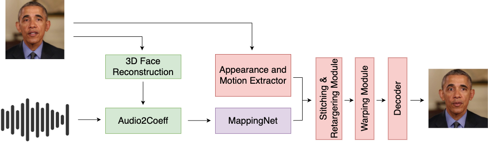

# LivePortraitTalker
This is a side project combining the pretrained models of [SadTalker](https://arxiv.org/abs/2211.12194) and [LivePortrait](https://arxiv.org/abs/2407.03168).

  

## Introduction

  

The pretrained models in the green boxes are from Sadtalker, the red boxes are used from LivePortrait repository. The MappintNet architecture in the purple box is taken from Sadtalker and trained. The VoxCeleb2 dataset was used to train MappingNet. Due to GPU prices, the model was trained using approximately 2000 videos (<2% of the dataset). Therefore, the results may not be consistent and high quality. However, this work proves the concept. 

## Installation
- Python 3.6+
- `pip install -r requirements.txt`

## Inference
There are couple of options to generate talking head; _still_, _synthetic head pose generation_, reference head pose, _pupil control_, _video2video_.

#### Still

There is no head movements in this option. Only lips and blinks are generated.

`python inference.py --config_path config.yaml --source_path <path/to/source/image> --audio_path <path/to/audio> --save_path <path/to/save/folder> --still`

#### Synthetic Head Pose Generation

Most talking head papers, such as SadTalker, generate head poses from the input audio. However, I do not think that head poses have a common features with audio. Therefore, I proposed Synthetic Head Pose Generation without using audio. This approach can generate head poses more naturally then previous one. I will give more information about Synthetic Head Pose Generation in next sections.

`python inference.py --config_path config.yaml --source_path <path/to/source/image> --audio_path <path/to/audio> --save_path <path/to/save/folder>`

#### Reference Head Pose

This option takes reference video as a input and generates talking head using poses of the person from the reference video. Once reference video is processed, head poses are saved to be used for next generation to increase inference speed. In some cases input audio and the reference head poses can be irrelevant, therefore should be used with more stable reference head poses.

`python inference.py --config_path config.yaml --source_path <path/to/source/image> --audio_path <path/to/audio> --save_path <path/to/save/folder> --ref_head_pose_path <path/to/reference/video>`

This pipeline randomises the initial head pose frame, `ref_frames_from_zero` can be added if the initial frame should be 0;

`python inference.py --config_path config.yaml --source_path <path/to/source/image> --audio_path <path/to/audio> --save_path <path/to/save/folder> --ref_head_pose_path <path/to/reference/video> --ref_frames_from_zero`

#### Pupil Control

Unlike Sadtalker, this repository predicts only lip expressions. Therefore, other facial expression are taken from the source image. This can be problematic if the eyes in the source image are not looking directly at the camera. Thanks to the [ComfyUI-AdvancedLivePortrait](https://github.com/PowerHouseMan/ComfyUI-AdvancedLivePortrait), pupils can be aranged. 

`ython inference.py --config_path config.yaml --source_path <path/to/source/image> --audio_path <path/to/audio> --save_path <path/to/save/folder> --pupil_x <pupil/x/number> --pupil_y <pupil/y/number>`

#### Video2Video

This repository can also be used as a dubbing tool too. If the video ise given as a `source_path`. The repository generates the lips using audio, while providing the head poses as the original frame.

`python inference.py --config_path config.yaml --source_path <path/to/source/video> --audio_path <path/to/audio> --save_path <path/to/save/folder>`

## Head Pose Generation

## Acknowledgements
- [SadTalker](https://github.com/OpenTalker/SadTalker/tree/main)
- [LivePortrait](https://github.com/KwaiVGI/LivePortrait/tree/main)
- [One-Shot Free-View Neural Talking Head Synthesis](https://github.com/zhanglonghao1992/One-Shot_Free-View_Neural_Talking_Head_Synthesis)
