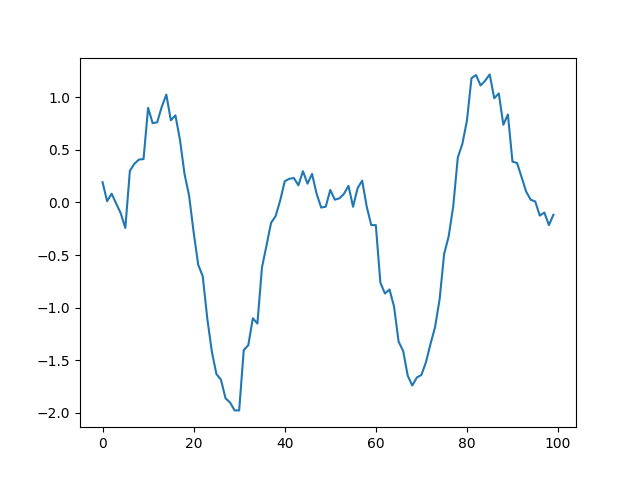

# Synthetic Head Pose Generation

Head pose generation is crucial in talking head generation. Because it increase reality of the generated head. By controlling head movements—such as yaw, roll and pitch according to speech, head pose generation enables a more engaging and believable representation. This realism is particularly important in applications like virtual avatars, video conferencing, where subtle head movements significantly impact the viewer's perception and immersion.

Most approaches like [Sadtalker](https://arxiv.org/abs/2211.12194), generates head pose from input audio. This is the easy way to generate head pose, but is there a strong relationship between audio and head movements? My answer is no. The outputs of the [Sadtalker Project Page](https://sadtalker.github.io/) may be proof of my thoughts. The output videos, especially with non-english audio, look completely unrealistic. Also the extreme movements can cause pupil to look away.

In this repository, I propose Synthetic Head Pose Generation. It only takes upper-lower-lip-related keypoints from MappingNet and generates realistic head movements. This method uses trigonometric functions to generate natural head movements. It also uses keypoints to obtain where the speaker becomes silent. Syntetic Head Pose Generation combines these methods to generate audio and language free head pose generation.

  <video src="https://github.com/user-attachments/assets/d7cbd241-c379-4c30-8b68-ae2f9026f8f9" type="video/mp4"> </video> 

## Trigonometry Based Head Pose Generation

This approach generates natural head movement by directly producing oscillations in pitch, yaw, and roll values within specified degree ranges and frequencies. Each axis (pitch, yaw, roll) uses a sinusoidal function to create smooth back-and-forth movement that mimics head gestures, like nodding or turning. The amplitude of the sinusoidal oscillation is derived from each axis’s range, so pitch, yaw, and roll all vary within their defined limits (e.g., pitch between -10 and 10 degrees).

  
     <i>Generated Head Pose Plot for Single Direction</i>

To make the motion more realistic, an easing function, modulates the speed of the movement, simulating how human motion naturally accelerates and decelerates. Additionally, small random jitter values are added to introduce micro-movements, preventing the animation from feeling too repetitive or mechanical. This combination of sinusoidal oscillations, easing, and subtle randomness results in fluid and lifelike head movements ideal for applications like virtual avatars, which require natural and engaging animation.

## Silence Detection

This is proposed to make generated videos more realistic. Head movements generated from the Trigonometry Based Head Pose Generation are quite natural. However, lip movements should be considered too. When the speaker becomes silent between sentences or words, head pose should be more stable. Therefore, Silence Detection is proposed to detect non-moving lips.

MappingNet network is only predicting lip keypoints in this work. When lip keypoints are experimented, it is seen that last two keypoints are related to lower and upper lips. Therefore these keypoints are used in silence detection approach.

Calculating the derivative of the keypoints states over time is a useful approach, to detect non-moving lips. Low derivative values indicate little to no movement, suggesting that the lips are in a stable state (either consistently open or closed). Therefore, derivative of the upper and lower lip keypoints are thresholded and lower values are assigned to zero, others are assigned to one. Also, o make transition from moving state to non-moving state, smoothing with a moving average is applied to thresholded results.

Finally, output of the Silence Detection and Trigonometry Based Head Pose Generation are multiplied to obtain realistic head poses.